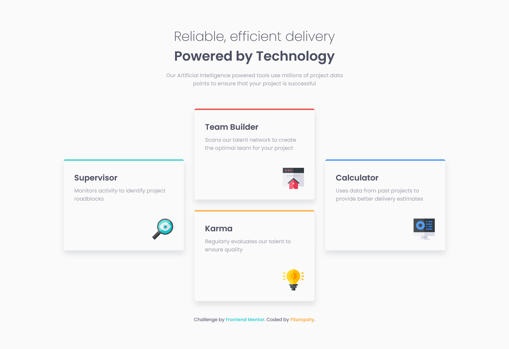

# Frontend Mentor - Four card feature section solution

This is a solution to the [Four card feature section challenge on Frontend Mentor](https://www.frontendmentor.io/challenges/four-card-feature-section-weK1eFYK). Frontend Mentor challenges help you improve your coding skills by building realistic projects.

## Table of contents

- [Frontend Mentor - Four card feature section solution](#frontend-mentor---four-card-feature-section-solution)
  - [Table of contents](#table-of-contents)
  - [Overview](#overview)
    - [The challenge](#the-challenge)
    - [Screenshot](#screenshot)
    - [Links](#links)
  - [My process](#my-process)
    - [Built with](#built-with)
    - [What I learned](#what-i-learned)
    - [Useful resources](#useful-resources)
  - [Author](#author)

## Overview

### The challenge

Users should be able to:

- View the optimal layout for the site depending on their device's screen size

### Screenshot




### Links

- Solution URL: [Frontendmentor.io]()
- Live Site URL: [fsuropaty.github.io](https://fsuropaty.github.io/four-card-feature-section-challenge)

## My process

### Built with

- Semantic HTML5 markup
- CSS custom properties
- CSS Grid
- Mobile-first workflow

### What I learned

I learned about :

- CSS grid area properties

```css
.card-wrapper {
  grid-template-columns: repeat(3, 1fr);
  margin: 0 10rem;
}

.supervisor {
  grid-area: 1 / 1 / 3 / 2;
  height: fit-content;
  place-self: center;
}

.calculator {
  grid-area: 1 / 3 / 3 /4;
  height: fit-content;
  place-self: center;
}
```

### Useful resources

- [W3Schools](https://www.w3schools.com) - Pretty much your guidebook in website development
- [MDN](https://developer.mozilla.org) - W3Schools but from Mozilla.
- [Layoutit!](https://grid.layoutit.com) - A very cool grid generator

## Author

- Website - [fsuropaty]()
- Frontend Mentor - [@fsuropaty](https://www.frontendmentor.io/profile/fsuropaty)
